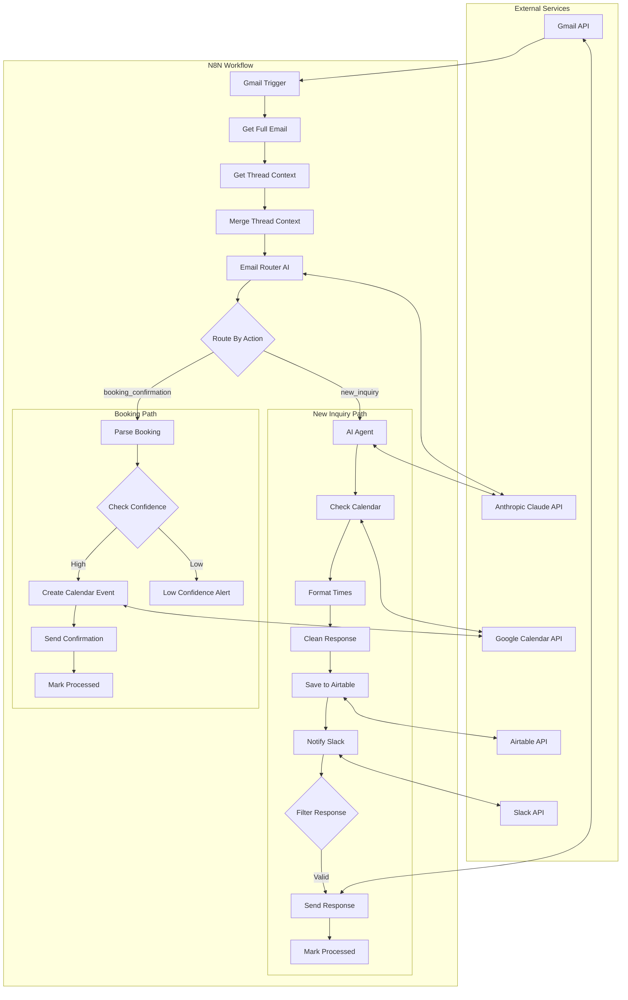

# Email Agent Architecture Overview

> Complete technical reference for the Updraft Email Co-Pilot system architecture.

## System Overview

The Email Co-Pilot is an AI-powered email automation system that:
- Monitors Gmail inboxes for new messages
- Uses AI to classify and draft contextual responses
- Checks calendar availability across multiple calendars
- Offers specific meeting times to prospects
- Automatically books meetings when recipients confirm
- Logs all interactions for review and tracking

### Design Principles

1. **Lift Over Thrust** - Automate repetitive work to create leverage
2. **Client Data Sovereignty** - All data stays in client's own accounts
3. **Graceful Degradation** - System alerts humans when confidence is low
4. **Audit Trail** - Every action is logged for review

---

## High-Level Architecture

```
┌─────────────────────────────────────────────────────────────────────────────┐
│                              EXTERNAL SERVICES                               │
├──────────────┬──────────────┬──────────────┬──────────────┬────────────────┤
│   Gmail API  │ Calendar API │  Claude API  │ Airtable API │   Slack API    │
│  (Google)    │   (Google)   │ (Anthropic)  │              │                │
└──────┬───────┴──────┬───────┴──────┬───────┴──────┬───────┴────────┬───────┘
       │              │              │              │                │
       ▼              ▼              ▼              ▼                ▼
┌─────────────────────────────────────────────────────────────────────────────┐
│                           N8N WORKFLOW ENGINE                                │
│  ┌─────────────────────────────────────────────────────────────────────┐   │
│  │                         EMAIL PROCESSING FLOW                        │   │
│  │                                                                      │   │
│  │  Trigger → Get Thread → Classify → Route → Process → Notify → Mark  │   │
│  │                                                                      │   │
│  └─────────────────────────────────────────────────────────────────────┘   │
└─────────────────────────────────────────────────────────────────────────────┘
```

---

## Data Flow Diagram



---

## Component Architecture

### Layer 1: Trigger Layer

| Component | Technology | Purpose |
|-----------|-----------|---------|
| Gmail Trigger | N8N Gmail Node | Poll inbox every 5 minutes for unprocessed emails |

**Key Characteristics:**
- Polling-based (not webhook) for reliability
- Filters by label to prevent duplicate processing
- Captures minimal data; full fetch in next step

### Layer 2: Data Enrichment Layer

| Component | Technology | Purpose |
|-----------|-----------|---------|
| Get Full Email | N8N Gmail Node | Retrieve complete email content |
| Get Thread Context | N8N Gmail Node | Fetch entire conversation history |
| Merge Thread Context | N8N Code Node | Combine data into unified structure |

**Data Transformation:**
```
Input: Gmail API raw response (headers, payload, parts)
Output: Normalized email object with:
  - id, threadId
  - subject, date, snippet
  - from (parsed email + name)
  - thread_history (previous messages summarized)
  - thread_length
```

### Layer 3: Classification Layer

| Component | Technology | Purpose |
|-----------|-----------|---------|
| Email Router | Claude Sonnet 4.5 | Classify intent and extract booking data |
| Route By Action | N8N If Node | Branch workflow based on classification |

**Classification Outputs:**
```json
// New inquiry
{"action": "new_inquiry"}

// Booking confirmation
{
  "action": "booking_confirmation",
  "selected_datetime": "2024-12-20T10:00:00",
  "timezone": "America/Chicago",
  "confidence": "high"
}
```

### Layer 4: Processing Layer

#### New Inquiry Path:

| Component | Technology | Purpose |
|-----------|-----------|---------|
| AI Agent | Claude Sonnet 4.5 | Generate contextual response with tools |
| check_calendar_availability | HTTP Request to FreeBusy | Query calendar availability |
| format_available_times | JavaScript Code | Convert busy times to available slots |
| Clean Agent Response | JavaScript Code | Remove AI metadata from response |

#### Booking Path:

| Component | Technology | Purpose |
|-----------|-----------|---------|
| Parse Booking Details | JavaScript Code | Extract structured data from router |
| Check Confidence | N8N If Node | Route high vs low confidence bookings |
| Create Calendar Event | N8N Google Calendar | Create meeting with Google Meet |

### Layer 5: Persistence Layer

| Component | Technology | Purpose |
|-----------|-----------|---------|
| Save to Airtable | N8N Airtable Node | Log email and draft for review |
| Save Low Confidence | N8N Airtable Node | Log uncertain bookings for review |

### Layer 6: Notification Layer

| Component | Technology | Purpose |
|-----------|-----------|---------|
| Notify Slack | N8N Slack Node | Alert on new drafts |
| Notify Low Confidence | N8N Slack Node | Alert on bookings needing review |

### Layer 7: Action Layer

| Component | Technology | Purpose |
|-----------|-----------|---------|
| Send Email Response | N8N Gmail Node | Deliver AI-drafted response |
| Send Booking Confirmation | N8N Gmail Node | Confirm scheduled meeting |
| Mark as Processed | N8N Gmail Node | Add label to prevent re-processing |

---

## Workflow Execution Paths

### Path 1: New Inquiry (Standard)

```
1. Gmail Trigger       → Detects new email without processed label
2. Get Full Email      → Retrieves complete message content
3. Get Thread Context  → Fetches conversation history
4. Merge Thread Context → Creates unified data structure
5. Email Router        → AI classifies as "new_inquiry"
6. Route By Action     → Sends to AI Agent path
7. AI Agent            → Drafts response (may call calendar tools)
8. [If scheduling requested]:
   8a. check_calendar_availability → Queries FreeBusy API
   8b. format_available_times → Converts to readable slots
9. Clean Agent Response → Removes AI metadata
10. Save to Airtable   → Logs email and draft
11. Notify Slack       → Alerts of new draft ready
12. Filter             → Verifies response is valid
13. Send Email Response → Delivers via Gmail API
14. Mark as Processed  → Adds label to prevent re-processing
```

**Duration:** 15-45 seconds depending on AI response time

### Path 2: Booking Confirmation (High Confidence)

```
1-5. Same as Path 1
6. Email Router        → Classifies as "booking_confirmation" with datetime
7. Route By Action     → Sends to booking path
8. Parse Booking Details → Extracts datetime, contact info
9. Check Confidence    → Evaluates as "high"
10. Create Calendar Event → Creates event with Google Meet
11. Send Booking Confirmation → Emails meeting details
12. Mark Booking Processed → Adds processed label
```

**Duration:** 10-20 seconds

### Path 3: Booking Confirmation (Low Confidence)

```
1-9. Same as Path 2, but:
9. Check Confidence    → Evaluates as "low" or "medium"
10. Save Low Confidence → Logs to Airtable with "Needs Review" status
11. Notify Low Confidence → Alerts for manual intervention
12. Mark Processed     → Adds label (prevents duplicate processing)
```

**Duration:** 10-15 seconds

---

## Data Models

### Email Record (Airtable)

| Field | Type | Description | Source |
|-------|------|-------------|--------|
| Email ID | Text | Gmail message ID | Gmail API |
| Thread ID | Text | Gmail thread ID | Gmail API |
| From Email | Email | Sender address | Parsed from headers |
| From Name | Text | Sender display name | Parsed from headers |
| Subject | Text | Email subject | Headers |
| Body | Long Text | Email content | Gmail payload |
| Status | Select | Processing status | Workflow logic |
| Classification | Select | AI-determined category | Email Router |
| Agent Draft | Long Text | AI-generated response | AI Agent |
| Final Response | Long Text | Edited version (if changed) | Manual edit |
| Created | DateTime | Record creation time | Auto |
| Notes | Long Text | Internal notes | Manual |

### Thread Context (Internal)

```javascript
{
  id: "message_id",
  threadId: "thread_id",
  subject: "Email subject",
  date: "RFC 2822 date string",
  text: "Email body text",
  snippet: "Preview snippet",
  from: {
    value: [{
      address: "sender@example.com",
      name: "Sender Name"
    }]
  },
  to: "recipient@example.com",
  thread_history: "Formatted previous messages",
  thread_length: 3
}
```

### Booking Details (Internal)

```javascript
{
  action: "booking_confirmation",
  selected_datetime: "2024-12-20T10:00:00",
  timezone: "America/Chicago",
  confidence: "high",
  from_email: "contact@example.com",
  from_name: "Contact Name",
  subject: "Re: Meeting request",
  thread_id: "thread_id"
}
```

---

## Security Architecture

### Authentication Methods

| Service | Auth Method | Token Storage | Refresh |
|---------|-------------|---------------|---------|
| Gmail | OAuth 2.0 | N8N Credential Store | Automatic |
| Google Calendar | OAuth 2.0 | N8N Credential Store | Automatic |
| Anthropic | API Key | N8N Credential Store | N/A |
| Airtable | PAT | N8N Credential Store | N/A |
| Slack | OAuth 2.0 | N8N Credential Store | Automatic |

### Data Security

| Concern | Mitigation |
|---------|------------|
| Email content storage | Stored only in client's Airtable |
| Credential exposure | All credentials encrypted in N8N |
| Cross-client access | Single-tenant workflows per client |
| AI data retention | Anthropic does not train on API data |
| Revocation | Client can revoke OAuth access anytime |

### Access Control

- N8N instance: Admin access only (Michael)
- Airtable base: Client-specific access
- Slack channel: Client workspace only
- Gmail/Calendar: OAuth scoped to specific account

---

## Performance Characteristics

### Latency Breakdown

| Stage | Typical Duration | Max Duration |
|-------|-----------------|--------------|
| Gmail Trigger Poll | 5 min interval | 5 min |
| Email Fetch | 500ms | 2s |
| Thread Fetch | 500ms | 2s |
| Email Router (AI) | 2-5s | 30s |
| AI Agent (AI) | 5-15s | 60s |
| Calendar Check | 500ms | 2s |
| Airtable Write | 300ms | 1s |
| Slack Notify | 200ms | 1s |
| Email Send | 500ms | 2s |
| **Total (New Inquiry)** | **15-30s** | **90s** |
| **Total (Booking)** | **10-15s** | **40s** |

### Throughput

| Metric | Limit | Notes |
|--------|-------|-------|
| Emails per hour | ~100 | Limited by API quotas |
| Concurrent executions | Depends on N8N plan | Cloud: varies |
| AI calls per minute | 40+ | Anthropic tier dependent |

### Resource Usage

| Resource | Estimate per Email |
|----------|-------------------|
| Claude tokens (input) | 500-1500 |
| Claude tokens (output) | 200-500 |
| Gmail API quota units | ~115 |
| Calendar API calls | 1-2 |
| Airtable API calls | 1-2 |

---

## Failure Modes & Recovery

### Component Failure Matrix

| Component Failure | Impact | Auto-Recovery | Manual Action |
|-------------------|--------|---------------|---------------|
| Gmail OAuth expired | No new triggers | N8N refresh | Re-auth if needed |
| Calendar OAuth expired | No availability | N8N refresh | Re-auth if needed |
| Anthropic API error | AI steps fail | Retry logic | Check quota/key |
| Airtable API error | No logging | N/A | Check credentials |
| Slack API error | No notifications | N/A | Check credentials |
| N8N platform outage | Complete stop | Wait | N/A |

### Error Handling Strategy

1. **Credential Errors**: Logged, workflow stops, notification sent
2. **API Rate Limits**: N8N built-in retry with backoff
3. **AI Errors**: Logged, email not processed, stays unread
4. **Partial Failures**: Transaction not atomic; may need manual cleanup

---

## Scalability Considerations

### Current Architecture Limits

- **Single inbox per workflow**: Each client needs dedicated workflow
- **Sequential processing**: Emails processed one at a time
- **Polling delay**: 5-minute maximum detection latency

### Scaling Strategies (Future)

| Growth Scenario | Solution |
|-----------------|----------|
| More clients | Duplicate workflow, update credentials |
| Higher volume | Reduce poll interval, parallel workflows |
| Multiple inboxes | Multiple triggers or webhook integration |
| Faster response | Webhook triggers (requires additional setup) |

---

## Monitoring & Observability

### N8N Built-in Monitoring

- Execution history with logs
- Success/failure counts
- Execution duration tracking
- Error details and stack traces

### Recommended Alerts

| Condition | Alert Via | Priority |
|-----------|-----------|----------|
| 3+ consecutive failures | Slack/Email | High |
| Execution time > 60s | Slack | Medium |
| OAuth credential error | Email | Critical |
| 0 executions in 24h | Email | Medium |

### Key Metrics to Track

1. **Response Time**: Time from email arrival to response sent
2. **Booking Conversion**: % of scheduling requests that result in bookings
3. **Draft Approval Rate**: % of AI drafts sent without edit
4. **Error Rate**: % of executions with failures

---

## Related Documents

- [Node Reference](./NODE_REFERENCE.md) - Detailed node documentation
- [API Dependencies](./API_DEPENDENCIES.md) - External service details
- [Disaster Recovery](./DISASTER_RECOVERY.md) - Failure handling procedures
- [Troubleshooting Playbook](../internal/TROUBLESHOOTING_PLAYBOOK.md) - Issue resolution
